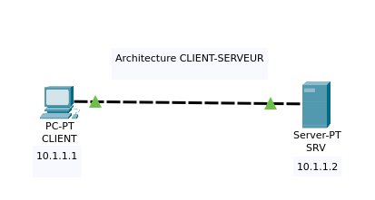

# Un réseau Informatique 

## Définition: 

Un **Réseau informatique** est un **emsemble** d'équipement electronique (Nodes ou Noeuds en Français) **interconnectés** (tels que des serveurs, des ordinateurs, des imprimantes, de la téléphonie VoIP, etc) qui **échange** des **données** et des **ressources** via des **câbles** ou des **connexions sans fils** (tel que le Wi-Fi / Bluetooth).

Les réseau utilise des **protocoles** pour **standardiser la communication** entre les différents équipements.
Il permets de **fournir** des **services** comme le partage de fichier ou d'imprimantes, et tant d'autres.

## Serveur, Client, Port et Protocoles 

#### Un Serveur
Un serveur est un ordinateur ou un système infortique qui fournit des services, des ressources ou des fonctionnalités à d'autres ordinateurs, appareils ou utilisateurs au sein d'un réseau.

#### un Client 

Un client est un ordinateur, un périphérique, ou un programmes qui accèdent aux services, ressources ou fonctionnalités fourni par un serveur.
Contrairement au serveur qui fourni les services, le Client demande et utilise ces services.

#### Un Port

En informatique un port est un numéro de communication associès à un processus (service) ou une application sur un système informatique.
Il permet d'acheminer les données vers la bonne application ou services sur un serveur distant, il existe des ports bien connus, réservés à des services spécifiques et des ports dynamiques utilisés temporairement.

!!! Info Les ports sont essentiels pour la communications réseau en permettant l'identification et le routage efficace des données.

#### Protocoles

En Informatique, un protocole est un emsemble de règles permettant à des équipements de communiquer entre eux de manière organisée et cohérente sur un réseau. 
Il définit comment les données sont échangées, structurés et interpréter facilitant la transmission d'information fiable et compréhensible entre les partie impliquées.

##### Exemple d'architecture Client-Serveur

Ouvrir le fichier: `client-server-architecture.pkt` dans packet-tracer
Instructions  à Suivre pour reproduire le LAB: 
```
# Créer un nouveau Serveur qu'on appelera SRV
# Créer un nouveau ordinateur de bureau qu'on appelera CLIENT

# pour l'adressage IP on choisira la plage ip : 10.1.1.0/24 
(soit un masque de sous réseau 255.255.255.0)

# On attribuera l'IP 10.1.1.1 au CLIENT
# On attribuera l'IP 10.1.1.2 au SRV
# Faire un ping vers le SRV depuis le CLIENT
```
#### Correction

